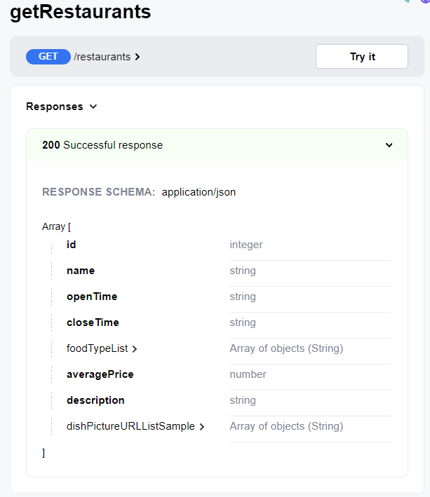

# Rendu Rapport D2 - Team K

# 512 Eats

Équipe :

- ALLAIN Emma : QA
- BACON Roxane  : OPS
- FADDA RODRIGUEZ Antoine : SA
- LEFÈVRE Clément : PO

# 1. Périmètre fonctionnel

## 1.1 Hypothèses de travail & limites identfiées

### Hypothèses de travail

Pour mener à bien notre projet et répondre aux exigences, nous avons formulé plusieurs hypothèses de travail pour
clarifier certains points :

- #### H1. Localisation pré-enregistrée : Les localisations sont supposées être déjà enregistrées dans la base de données, sans création en temps réel.
- #### H2. Plat uniquement : Les restaurants ne proposent que des plats individuels (entrée, plat, dessert, boisson) sans formules, laissant aux clients le soin de composer leur repas.
- #### H3. 1 livreur <=> 1 commande : Chaque commande (subOrder) est prise en charge par un seul livreur, sans affectation multiple.
- #### H4. Horaires d’ouverture : Les restaurants sont ouverts tous les jours de la semaine, du lundi au vendredi, avec des horaires fixes.
- #### H5. Temps moyen de préparation d’une commande : Dans chaque restaurant, toutes les commandes ont un temps de préparation moyen identique prédéfini par le manager du restaurant.
- #### H6. Temps maximum de préparation : Le temps maximal pour préparer une commande est supposé être de 30 minutes.
- #### H7. Temps moyen de livraison : Le temps de livraison estimé pour une commande est de 20 minutes.

### Limites identifiées

En fonction des hypothèses posées et des exigences initiales, certaines limites ont été identifiées :

- #### L1. Livraisons non optimisées : Le trafic n’est pas pris en compte, et chaque livreur est affecté à une seule commande, ce qui n’optimise pas les livraisons dans le cas de commandes individuelles non groupées.
- #### L2. Pas de formules : Chaque client doit composer son repas en sélectionnant les produits individuellement sur la carte.
- #### L3. Non responsabilité du paiement: Le processus de paiement n’étant pas à prendre en charge, malgré une couverture de cas d’erreur pour les objets envoyés au processus de paiement, nous ne pouvons pas garantir le bon déroulé d’un processus externe.
- #### L4. Préavis de commande de 50 min minimum : Pour assurer la préparation de la commande, celle-ci doit être faite au moins 50 minutes à l’avance car il faut prendre en compte le temps de livraison (20 minutes) et le temps de préparation maximum (30 minutes dans le créneau horaire du restaurant).

### Stratégie choisie et éléments spécifiques

Nous avons mis en place une stratégie bien particulière pour la gestion des commandes en fonction des temps de
préparation de celles-ci. Cette stratégie permet un compromis entre les utilisateurs et les restaurateurs, et donc
éviter de créer une frustration importante d’un côté comme de l’autre. Nous sommes partis de l’exigence R2 qui fixe la
durée d’un créneau (time slot) à 30 minutes. Exemple de fonctionnement : En ayant un temps moyen de préparation de 10
minutes par commande, avec une seule personne pour les préparer, nous autorisons 3 commandes passée par TimeSlot (30
minutes/10 minutes \* 1 préparateur(s) de commande). Si nous avons 2 préparateurs de commande, alors nous permettrons à
6 utilisateurs enregistrés de passer une commande, etc. Remarque: Si il y a trop de demandes pour un restaurant à un
horaire précis, alors nous n'autorisons plus la création de commande pour ce restaurant. Reprenons notre exemple avec 2
préparateurs de commandes, soit 6 commandes possibles. Si les 3 premières prennent l'entièreté du temps disponible,
alors seulement 3 utilisateurs ayant déjà créé une commande seront bloqués avant de pouvoir valider celle-ci. (voir
schéma ci-dessous). A l’inverse, peut être que les 6 commandes seront courtes et du temps pourrait être perdu, ou bien
que le temps de préparation de la dernière commande acceptée peut être plus long que le temps disponible, ce qui
mettrait en retard le restaurant.

## 1.2 Points non implémentés relativement à la spécification et aux extensions requises

Nous n'avons pas implémenté l'extension du login sur l'interface. Il n'y a donc pas de gestion de token ni de mot de
passe.

## 1.3 Points forts

1. **Architecture claire et modulaire** :

- L'architecture **multi modulaire Maven** avec séparation nette des responsabilités permet une organisation structurée
  et une lisibilité accrue pour les développeurs.

- La décomposition en services métiers facilite l’évolutivité et la maintenance.

2. **Gestion optimisée des créneaux de préparation** :

La stratégie choisie pour limiter les commandes par créneau en fonction du nombre de préparateurs assure un équilibre
entre l’expérience utilisateur et les contraintes des restaurants.

Le mécanisme garantit une répartition cohérente des charges (temps de préparation limité et temps d’attente
raisonnable).

3. **Utilisation de Spring Data JPA** :

Simplification de l’accès aux données avec un modèle orienté objet clair et optimisé grâce aux repositories JPA.

4. **Ergonomie du client web validée** :

- L’interface a été testée auprès des étudiants de la promotion, qui ont unanimement trouvé l’application
  _ergonomique_ et facile à utiliser.

5. **Génération de la documentation OpenAPI automatique** :

- La documentation OpenAPI de chaque service est générée automatiquement dès leur lancement, cela permet une
  transparence claire au niveau des endpoints, et la vérification de leur fonctionnement avant de les connecter à
  l’interface graphique.

- Elle inclut des descriptions détaillées des endpoints, des exemples de requêtes et de réponses, ainsi que les codes
  d’erreur possibles.

6. **Tests complètement fonctionnels** :

- Des **tests Cucumber** ont été mis en place avant l’implémentation des services REST. Tous les tests sont actuellement
  fonctionnels, ils ont tous été corrigés pour valider l’ensemble du projet. La plupart sont comparables à des tests
  d’intégration car ils utilisent une base de donnée H2 démarrée dans le contexte de test, stockée temporairement en
  mémoire RAM. D’autres utilisent des mocks de nos repositories JPA.

7. **Gestion des erreurs claires** :

- Les réponses du backend en cas d’erreur sont structurées et permettent un débogage plus efficace. Cela contribue
  également à une meilleure expérience utilisateur.

- Si le restaurant n’est pas trouvé, une réponse claire est\
  renvoyée :

<!---->

    {"message": "Le restaurant n’existe pas", "stackTrace":”...”} avec un code 404

***

## 1.4 Points faibles

1. **Endpoints REST non conventionnels** :

Certains endpoints utilisent des verbes ou des structures non standards, ce qui rend l’API moins intuitive pour les
développeurs externes. Une refonte de la structure des routes serait bénéfique.

La migration vers des conventions RESTful peut être effectuée en une itération en définissant un plan de refactorisation
et une mise à jour de la documentation OpenAPI.

2. **Fonctionnalités manquantes** :

**Navigation libre des restaurants** : Actuellement, dans l’interface graphique les utilisateurs ne peuvent pas
consulter les menus des restaurants sans créer une commande. Cela limite l'expérience utilisateur.

**Gestion du profil utilisateur** : L'absence de login et de gestion des tokens empêche une gestion complète des
utilisateurs.

3. **Optimisation des livraisons** :

La restriction **1 livreur ↔ 1 commande** n’est pas optimale dans le cas de commandes proches géographiquement. Prendre
en compte le trafic et le regroupement de commandes serait une piste d’amélioration.

4. **Localisation dans les commandes groupées** :

La localisation des commandes groupées est figée dès leur création, ce qui peut nuire à la flexibilité pour les
utilisateurs.

# 2. Architecture

## 2.1 Présentation générale

Notre projet est architecturé de la manière suivante :

### 2.1.1 Client web

Le [client web](https://docs.google.com/document/d/14dnyKnp8ZtMsWTT1lN46xOGFPuthq5z2I1wiCW_2b80/edit#26-le-client-web)
est un projet à part de ce dépôt, il communique en REST avec le backend via
l'[API gateway](https://docs.google.com/document/d/14dnyKnp8ZtMsWTT1lN46xOGFPuthq5z2I1wiCW_2b80/edit#212-lapi-gateway)).
Il permet une utilisation optimisée et ergonomique de notre application.

### 2.1.2 Backend

Tout le code du backend est disponible dans ce dépôt. Il s'agit d'
un [projet maven multimodule](https://www.baeldung.com/maven-multi-module).

#### 2.1.2 L'API gateway

L'API gateway (disponible dans [ce module](http://../api)) est l'interface de notre backend. Le client web lui envoie
des requêtes HTTP qu'elle "redirige" vers
le [service métier](https://docs.google.com/document/d/14dnyKnp8ZtMsWTT1lN46xOGFPuthq5z2I1wiCW_2b80/edit#213-les-services-m%C3%A9tiers)
adéquat. En exposant plusieurs controllers REST, l'API gateway peut interroger simplement le service métier concerné par
la requête et ainsi envoyer la réponse reçue vers
le [client web](https://docs.google.com/document/d/14dnyKnp8ZtMsWTT1lN46xOGFPuthq5z2I1wiCW_2b80/edit#211-client-web).
Pour simplifier fonctionnement et alléger son code, les réponses reçues par l'API gateway ne sont pas désérialisées,
mais renvoyées telles quelles. Sa documentation OpenAPI est disponible [ici](http://../api/openapi.json).

#### 2.1.3 Les services métiers

Les services métiers sont les services qui gèrent les différentes entités (disponible
dans [ce module](http://../common-library/src/main/java/commonlibrary/model)) de notre application. Ils sont consommés
par
l'[API gateway](https://docs.google.com/document/d/14dnyKnp8ZtMsWTT1lN46xOGFPuthq5z2I1wiCW_2b80/edit#212-lapi-gateway).
Ils sont responsables de la logique métier et utilisent les entités qu'ils récupèrent grâce à
la [couche DAO](https://docs.google.com/document/d/14dnyKnp8ZtMsWTT1lN46xOGFPuthq5z2I1wiCW_2b80/edit#214-la-couche-dao).

#### 2.1.4 La couche DAO

La couche DAO (Data Access Object) est composée de
repositories [JPA](https://docs.google.com/document/d/14dnyKnp8ZtMsWTT1lN46xOGFPuthq5z2I1wiCW_2b80/edit#24-les-entit%C3%A9s) (
disponible dans [ce package](http://../common-library/src/main/java/commonlibrary/repository) du
module [common-library](http://../common-library)) qui permettent de communiquer avec
la [base de données](https://docs.google.com/document/d/14dnyKnp8ZtMsWTT1lN46xOGFPuthq5z2I1wiCW_2b80/edit#215-la-base-de-donn%C3%A9es).

#### 2.1.5 La base de données

La base de données est une base de données relationnelle PostgreSQL. Elle est composée de plusieurs tables qui
représentent les
différentes [entités](https://docs.google.com/document/d/14dnyKnp8ZtMsWTT1lN46xOGFPuthq5z2I1wiCW_2b80/edit#24-les-entit%C3%A9s)
de notre application. Elle est accessible par
les [repositories JPA](https://docs.google.com/document/d/14dnyKnp8ZtMsWTT1lN46xOGFPuthq5z2I1wiCW_2b80/edit#214-la-couche-dao).
Elle est exécutée dans un conteneur Docker lancé via [dokcer-compose](http://../docker-compose.yml)

## 2.2 Les services métiers

Les services métiers sont les services qui gèrent les différentes fonctionnalités de notre application. Ils sont
découpés en plusieurs services pour plus de clarté, de lisibilité et de maintenabilité. Ils sont tous dans le
module [service](http://../services) et sont répartis en 4 packages :

- [OrderService](http://../services/src/main/java/team/k/orderservice) : Gère les commandes

- [RestaurantService](http://../services/src/main/java/team/k/restaurantservice) : Gère les restaurants et plus
  particulièrement la partie utile pour les clients

- [GroupOrderService](http://../services/src/main/java/team/k/grouporderservice) : Gère les groupes de commandes

- [ManagementService](http://../services/src/main/java/team/k/managementservice) : Administre les restaurants

Chacun de ses packages contient :

- Une classe exécutable qui permet de lancer le service et son serveur REST

- Un controller qui expose les endpoints REST qui appellent les méthodes du service

- Un service qui contient la logique métier

- Une classe de configuration qui permet de configurer le service et notamment de définir les composants Spring à
  scanner

## 2.3 Utilisation de Spring Data JPA

Spring Data JPA est une bibliothèque qui permet de simplifier l'accès aux données en utilisant JPA. Elle permet de créer
des repositories JPA en utilisant des interfaces. Ces repositories permettent de communiquer avec la base de données
sans avoir à écrire de requêtes SQL, en effet, Spring Data JPA fournit des méthodes pour effectuer des opérations CRUD.
Ces repositories étant des Beans Spring, ils sont à injecter dans les services métiers. C'est pour cette raison que les
services métiers sont annotés avec `@Service`, ils sont eux, à injecter dans les controllers. Il en va donc de même pour
les controllers qui sont annotés avec `@Component`.

## 2.4 Les entités

Les entités sont les classes qui représentent les tables de la base de données, ce sont les modèles manipulés par les
services métiers. Elles sont toutes dans le package [model](http://../common-library/src/main/java/commonlibrary/model)
du module [common-library](http://../common-library). Elles sont toutes annotées avec `@Entity` pour indiquer à JPA
qu'elles représentent une table de la base de données. Elles sont aussi annotées avec `@Data` de Lombok pour générer
notamment les getters et les setters.

## 2.5 Les DTOs

Les DTOs (Data Transfer Object) sont des classes qui permettent de transférer des données entre le backend et le
frontend. Ils sont utilisés pour éviter de transférer des données inutiles et pour éviter de modifier les entités. Ils
sont tous dans le package [dto](http://../common-library/src/main/java/commonlibrary/dto) du
module [common-library](http://../common-library). Certaines classes ne sont pas utilisées actuellement, elles sont
conservées en vue d'une potentielle utilisation.

## 2.6 Le client web

## 2.7 Exemples de requêtes

### 2.7.1 Récupération des restaurants

### 2.7.2 Ajout d'un plat à une commande

# 3. Qualité des codes

En ce qui concerne l'auto-évaluation de notre code, voici nos observations : Code de bonne qualité :

- Le code est lisible avec des noms de méthodes et de classes transparentes.

- Les scénarios sont clairs et englobent la totalité des specs attendues notamment le scénario avec les commandes d'un
  group order.

- La gestion des erreurs est faite de sorte à envoyer des messages clairs et corrects concernant les problèmes ou les
  succès rencontrés afin d'avertir l'utilisateur du succès ou de l'échec de ses actions. Il est aussi pour nous plus
  pratique de débugger et de contrôler la maintenance de notre code.

- Sur le point de vue du partage des responsabilités, nous avons bien séparé les classes et les méthodes pour ne pas
  avoir trop de responsabilités dans une classe et rien dans les autres.

Code à améliorer :

- Nous avons encore certaines fonctionnalités à implémenter pour que notre projet soit complet et fonctionnel. Il
  manque notamment la gestion des localisations; à l'heure actuelle nous ne pouvons pas rentrer la
  localisation d'un group order à la fin de celle-ci et doit être décidée dès le début.

- Certains endpoints que nous avons mis en place dans le cadre de la communication REST ne sont pas conventionnels. En
  effet, dans nos controllers, nous pouvons voir des endpoints avec des verbes dans le chemin, ou alors avec des
  paramètres qui auraient dû être passés en "path variable" sont en fait passés dans des “request param”. La cause de ce
  problème est notre implémentation du framework REST qui traite les endpoints et les paramètres avec un système de
  d’expression régulière.

- La classe IndividualOrder hérite de la classe SubOrder, ce qui n’est pas idéal fonctionnellement et
  architecturalement. Par manque de temps, cette partie n’a pas été refactorisée mais nous souhaitions ajouter une
  classe abstraite ou une interface que SubOrder et IndividualOrder aurait pu étendre ou implémenter pour découpler leur
  logique.

- Nous aurions aussi pu ajouter des interfaces pour diminuer le couplage :
  - Orderable : pour abstraire le comportement commun des classes GroupOrder, SubOrder et IndividualOrder qui peuvent
    être commandées

- Locatable : pour abstraite le comportement commun des classes GroupOrder et IndividualOrder, qui ont toutes les deux
  un
  lieu de livraison

# 4. Gestion de projet

Nous avons choisi d’appliquer la stratégie de branche _gitflow_. Ainsi, pour chaque branche feature ou fix nous faisions
une pull request qui devait être relue et approuvée par au moins un membre de l’équipe pour que le merge sur dev soit
possible.

De plus, un pipeline vérifiait la qualité de nos développements en exécutant la commande maven test à chaque nouvelle
pull request.

### Zoom sur la deuxième partie du projet:

Concernant la seconde partie du projet, nous avons utilisé la méthode Scrum. Nous avons donc mis en place les éléments
suivants :

- un backlog des issues à effectuer

- des sprints réguliers d'une semaine

- des points bihebdomadaires pour statuer sur l'avancement du projet

Nous avons divisé l'équipe en deux binômes pour travailler sur les différentes parties du projet. Un des binômes
avançait le back-end, la séparation en micro-services et la gestion de la base de données. Le second binôme avançait en
parallèle sur le front-end et la gestion de l'interface utilisateur.

En ce qui concerne le front-end, une fois l'interface globale effectuée sur la base des user stories et des specs, le
binôme est venu travailler sur le back-end pour la création de l'API gateway et des micro-services

# 5.Retrospective

### Rôle de chacun:

Emma Allain QA: Sur le projet, nous avons implémenté différents types de tests afin de s’assurer du bon fonctionnement
de
notre développement/ projet. Nous avons mis en place des tests cucumber avec de divers scénarios recouvrant les
exigences et extensions implémentées pour le côté fonctionnel. De plus à ces tests cucumber, nous avons implémenté des
tests unitaires pour s’assurer du bon fonctionnement de nos méthodes et de nos algorithmes. Enfin toutes nos user
stories en must have étaient implémentées et testées lors de notre présentation. Nous avons donc bien priorisé nos
tâches.

Roxane Bacon OPS: Nous avons adopté une approche qui vise à assurer la qualité de notre projet, avec des tests Cucumber
pour les scénarios fonctionnels et des tests unitaires pour valider nos méthodes et algorithmes. Le suivi de
l'avancement était géré via un board GitHub Project en Kanban, organisé en sprints hebdomadaires avec des milestones,
des user stories et des issues labellisées par priorité. Nous avons mis en place une stratégie de branches git flow :
une branche dev (devenue notre branche par défaut afin que les issues soient fermées automatiquement lorsqu’une pull
request sur dev est acceptée) pour tester les nouvelles fonctionnalités avant leur intégration dans main, garantissant
ainsi la stabilité. De plus, nous avons implémenté une stratégie de nommage : “feature/…”, “fix/…”, etc, visant à
organiser intelligemment les branches. La répartition des tâches était équilibrée, ce qui a permis de respecter les
délais et de gérer efficacement le développement.

Antoine Fadda Rodriguez SA : Pour assurer une architecture de qualité au projet, nous avons commencé par nous documenter
sur les principaux design patterns. De cette manière, nous avons été en capacité d’identifier les endroits où ils
allaient être utiles. En collaboration étroite avec le PO, nous avons aussi réalisé une importante phase de conception.
Celle-ci s’est avérée plutôt efficace car, depuis la dernière analyse ayant eu lieu après l’auto-évaluation, notre
architecture n’a pas subi de changement majeur. De plus, selon Sonarqube, nous avons moins d’une heure de dette
technique liée à quelques soucis de maintenabilité (constructeur prenant trop de paramètres, attributs pas encore
utilisés, …)

Clément Lefèvre PO : Nous avons structuré le travail de développement en veillant à ce que chaque fonctionnalité soit
correctement définie et priorisée pour répondre aux besoins du projet. Nous avons élaboré chaque user story en utilisant
les templates d'issues fournies, garantissant une définition claire des critères d'acceptation et des objectifs. Nous
avons veillé à ce que les user stories soient bien comprises par l'équipe avant le début de chaque sprint, facilitant
ainsi une planification efficace et une exécution fluide.

Le suivi de l'avancement a été assuré via un board GitHub Project en Kanban, où nous avons travaillé en sprints d'une
semaine, permettant une gestion agile de nos développements. Chaque sprint était associé à une milestone, et les issues
étaient labellisées selon leur priorité et leur nature (feature, test, user story), ce qui a permis un suivi clair et
une transparence dans l'avancement des travaux.

Nous nous sommes également assurés que la répartition des tâches soit équitable au sein de l'équipe, tout en veillant à
ce que les deadlines soient respectées. Nous avons pour la deuxième partie du projet travaillé en binôme côté
front-end : Clément LEFEVRE et Roxane BACON et partie back-end : Antoine FADDA-RODRIGUEZ et Emma ALLAIN. En finissant à
4 sur le backend.

### Bilan global

En ce qui concerne nos rétrospectives, nous avons eu des points positifs et des points négatifs, mais beaucoup
d'expérience acquise en termes de gestion de projet.

#### Points positifs

Nous avons su tenir un kanban à jour avec des user stories et des issues bien définies. Nous avons su avancer sur le
projet en suivant les sprints et en respectant les délais. Nous avons su nous répartir les tâches de manière équitable
et nous avons su communiquer régulièrement pour faire le point sur l'avancement du projet.

Nous avons également su nous adapter à la situation et aux problèmes rencontrés. Nous avons su prendre des décisions
pour avancer sur le projet et rebondir sur les problèmes rencontrés.

#### Leçons apprises

On aura commis une grosse erreur lors de cette partie du projet.

En effet, pour la partie back-end, nous avions décidé de travailler sur une architecture complexe avec des technos peu
documentées pour le temps imparti. Nous avons, pour le binôme du back-end, malheureusement passé trois semaines a essayé
de venir à bout de cette architecture et la décision de revenir sur le choix de notre architecture a été prise une
semaine avant le rendu.

Cela nous a fait perdre beaucoup de temps. De cette erreur, nous pouvons en retirer quelques leçons :

- Il faut toujours se poser la question de la complexité de l'architecture et de la technologie utilisée.

- Il faut toujours se poser la question de la faisabilité du projet dans le temps imparti.

- Il ne faut pas rester dans un schéma compliqué autant de temps si on voit que cela ne fonctionne pas.

# 6. Autoévaluation

- Concernant l'attribution des points, ayant tous travaillés équitablement, nous avons décidé d’attribuer les points de
  manière homogène à chaque membre de l’équipe:
  Emma: 100pts / Roxane: 100pts / Antoine: 100pts / Clément: 100pts
