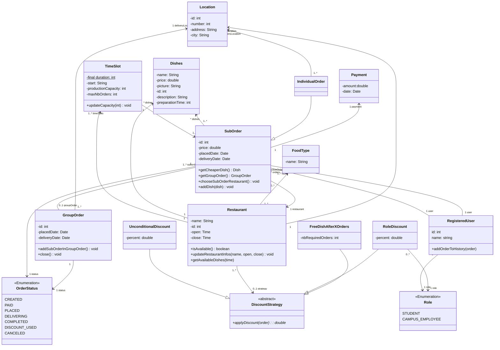

# Diagramme de classe

```mermaid
classDiagram
    TimeSlot "1..* timeSlots" <-- "1" Restaurant
    TimeSlot "1" --> "1..* orders" SubOrder
    Dishes "* dishes" <-- "1" Restaurant
    SubOrder "0..* orders" -- "1 user" RegisteredUser
    SubOrder "0..1 activeOrder" -- "1 user" RegisteredUser
    RegisteredUser "1" --> "1 role" Role
    SubOrder "1" --> "1 status" OrderStatus
    GroupOrder "1" --> "1 status" OrderStatus
    FoodType " 1..* types" <-- "1..*" Restaurant
    SubOrder "0..*" --> "1 restaurant" Restaurant
    Dishes "* dishes" <-- "1..*" SubOrder
    IndividualOrder --|> SubOrder
    Payment "1 payment" <-- "1" SubOrder
    SubOrder "1..* suborders" -- "0..1 groupOrder" GroupOrder
    Location "1 deliveryLocation" <-- "1..*" GroupOrder
    Location "1 location" <-- "1" Restaurant
    Location "1 deliveryLocation" <-- "1..*" IndividualOrder
    UnconditionalDiscount --|> DiscountStrategy
    Restaurant "1..*" --> "0..1 strategy" DiscountStrategy
    RoleDiscount --|> DiscountStrategy
    FreeDishAfterXOrders --|> DiscountStrategy
    RoleDiscount "0..*" --> "1 role" Role
    class Dishes {
        -name: String
        -price: double
        -picture: String
        -id: int
        -description: String
        -preparationTime: int
    }
    class Restaurant {
        -name: String
        -id: int
        -open: Time
        -close: Time
        +isAvailable() boolean
        +updateRestaurantInfos(name, open, close) void
        +getAvailableDishes(time)
    }
    class TimeSlot {
        -final duration: int$
        -start: String
        -productionCapacity: int
        -maxNbOrders: int
        +updateCapacity(int) void
    }
    class FoodType {
        -name: String
    }
    class IndividualOrder {
    }
    class Payment {
        -amount:double
        -date: Date
    }
    class Location {
        -id: int
        -number: int
        -address: String
        -city: String
    }
    class SubOrder {
        -id: int
        -price: double
        -placedDate: Date
        -deliveryDate: Date
        +getCheaperDish() Dish
        +getGroupOrder() GroupOrder
        +chooseSubOrderRestaurant() void
        +addDish(dish) void
    }
    class GroupOrder {
        -id: int
        -placedDate: Date
        -deliveryDate: Date
        +addSubOrderInGroupOrder() void
        +close() void
    }
    class OrderStatus {
        <<Enumeration>>
        CREATED
        PAID
        PLACED
        DELIVERING
        COMPLETED
        DISCOUNT_USED
        CANCELED
    }
    class RegisteredUser {
        id: int
        name: string
        +addOrderToHistory(order)
    }
    class Role {
        <<Enumeration>>
        STUDENT
        CAMPUS_EMPLOYEE
    }
    class DiscountStrategy {
        <<abstract>>
        +applyDiscount(order): double*
    }
    class UnconditionalDiscount {
        -percent: double
    }
    class RoleDiscount {
        -percent: double
    }
    class FreeDishAfterXOrders {
        -nbRequiredOrders: int
    } 
```
