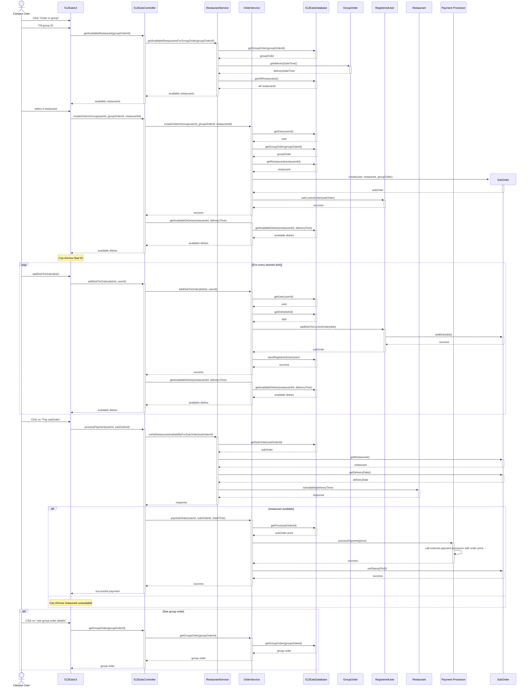

# Diagramme de séquence

```mermaid
sequenceDiagram
    actor CU as Campus User
    participant EatsUI as 512EatsUI
    participant RC as 512EatsController
    participant RS as RestaurantService
    participant OS as OrderService
    participant DB as 512EatsDatabase
    participant GO as GroupOrder
    participant RU as RegisteredUser
    participant R as Restaurant
    participant Payment as Payment Processor
    CU ->> EatsUI: Click "Order in group"
    CU ->> EatsUI: Fill group ID
    EatsUI ->>+ RC: getAvailableRestaurant(groupOrderId)
    RC ->>+ RS: getAvailableRestaurantsForGroupOrder(groupOrderId)
    RS ->>+ DB: getGroupOrder(groupOrderId)
    DB -->>- RS: groupOrder
    RS ->>+ GO: getdeliveryDateTime()
    GO -->>- RS: deliveryDateTime
    RS ->>+ DB: getAllRestaurants()
    DB -->>- RS: all restaurants
    RS -->>- RC: available restaurants
    RC -->>- EatsUI: available restaurants
    CU ->> EatsUI: select a restaurant
    EatsUI ->>+ RC: createOrderInGroup(userId, groupOrderId, restaurantId)
    RC ->>+ OS: createOrderInGroup(userId, groupOrderId, restaurantId)
    OS ->>+ DB: getUser(userId)
    DB -->>- OS: user
    OS ->>+ DB: getGroupOrder(groupOrderId)
    DB -->>- OS: groupOrder
    OS ->>+ DB: getRestaurant(restaurantId)
    DB -->>- OS: restaurant
    create participant SO as SubOrder
    OS ->>+ SO: create(user, restaurant, groupOrder)
    SO -->>- OS: subOrder
    OS ->>+ RU: setCurrentOrder(subOrder)
    RU -->>- OS: success
    OS -->>- RC: success
    RC ->+ OS: getAvailableDishes(restaurantId, deliveryTime)
    OS ->>+ DB: getAvailableDishes(restaurantId, deliveryTime)
    DB -->>- OS: available dishes
    OS -->>- RC: available dishes
    RC -->>- EatsUI: available dishes
    Note over EatsUI: Cas d'erreur Bad ID
    loop [For every desired dish]
    CU ->> EatsUI: addDishToOrder(dish)
    EatsUI ->>+ RC: addDishToOrder(dishId, userId)
    RC ->>+ OS: addDishToOrder(dishId, userId)
    OS ->>+ DB: getUser(userId)
    DB -->>- OS: user
    OS ->>+ DB: getDish(dishId)
    DB -->>- OS: dish
    OS ->>+ RU: addDishToCurrentOrder(dish)
    RU ->>+ SO: addDish(dish)
    SO -->>- RU: success
    RU -->>- OS: subOrder
    OS ->>+ DB: saveRegisteredUser(user)
    DB -->>- OS: success
    OS -->>- RC: success
    RC ->+ OS: getAvailableDishes(restaurantId, deliveryTime)
    OS ->>+ DB: getAvailableDishes(restaurantId, deliveryTime)
    DB -->>- OS: available dishes
    OS -->>- RC: available dishes
    RC -->>- EatsUI: available dishes
    end
    CU ->> EatsUI: Click on "Pay subOrder"
    EatsUI ->>+ RC: processPayment(userId, subOrderId)
    RC ->>+ RS: verifyRestaurantAvailabilityForSubOrder(subOrderId)
    RS ->>+ DB: getSubOrder(subOrderId)
    DB -->>- RS: subOrder
    RS ->>+ SO: getRestaurant()
    SO -->>- RS: restaurant
    RS ->>+ SO: getDeliveryDate()
    SO -->>- RS: deliveryDate
    RS ->>+ R: isAvailable(deliveryTime)
    R -->>- RS: response
    RS -->>- RC: response
    alt restaurant available
    RC ->>+ OS: paySubOrder(userId, subOrderId, DateTime)
    OS ->>+ DB: getPrice(subOrderId)
    DB -->>- OS: subOrder price
    OS ->>+ Payment: processPayment(price)
    Payment ->> Payment: call external payment processor with order price
    Payment -->>- OS: success
    OS ->>+ SO: setStatus(PAID)
    SO -->>- OS: success
    OS -->>- RC: success
    RC -->>- EatsUI: successful payment
    else
    Note over EatsUI: Cas d'erreur restaurant unavailable
    end
    opt See group order
    CU ->> EatsUI: Click on "see group order details"
    EatsUI ->>+ RC: getGroupOrder(groupOrderId)
    RC ->>+ OS: getGroupOrder(groupOrderId)
    OS ->>+ DB: getGroupOrder(groupOrderId)
    DB -->>- OS: group order
    OS -->>- RC: group order
    RC -->>- EatsUI: group order
    end

```
